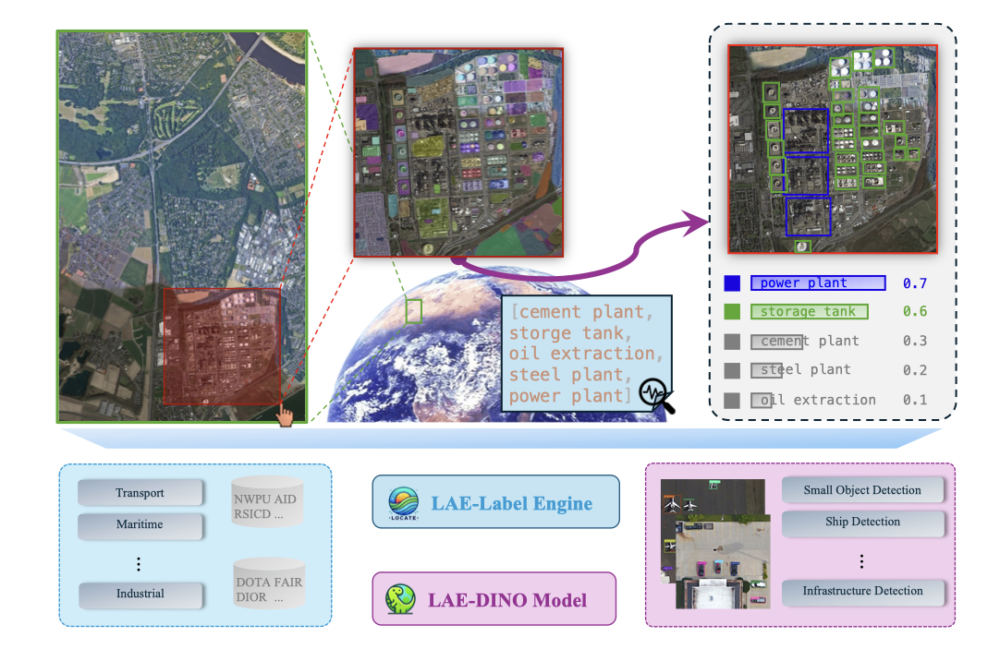
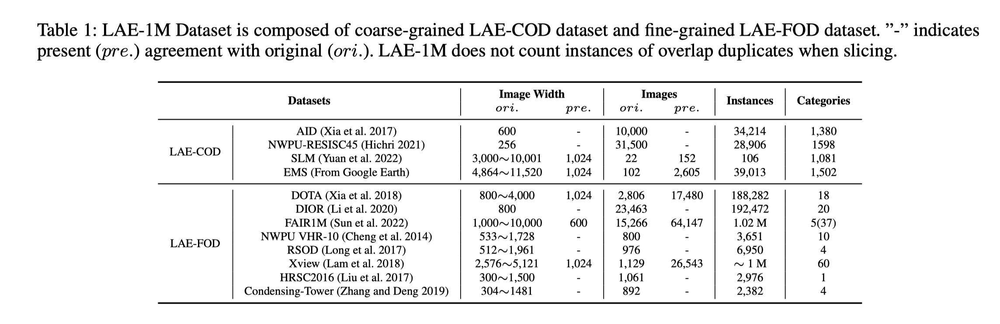
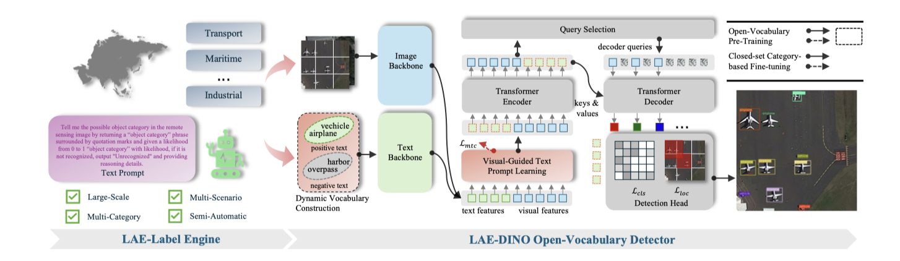

<div align="center">
<h1 align="center">  Locate Anything on Earth: Advancing Open-Vocabulary Object Detection for Remote Sensing Community</h1>


<h4 align="center"><em>Jiancheng Pan*, &nbsp; &nbsp; Yanxing Liu*, &nbsp; &nbsp; Yuqian Fu✉, &nbsp; &nbsp; Muyuan Ma,</em></h4>

<h4 align="center"><em>Jiaohao Li, &nbsp; &nbsp; Danda Pani Paudel, &nbsp; &nbsp;Luc Van Gool, &nbsp; &nbsp; Xiaomeng Huang✉ </em></h4>
<p align="center">
    
</p>

\* *Equal Contribution* &nbsp; &nbsp; Corresponding Author ✉

</div>

<p align="center">
<a href="http://arxiv.org/abs/2408.09110">"></a>
</p>

<p align="center">
  <a href="#news">News</a> |
  <a href="#abstract">Abstract</a> |
  <a href="#dataset">Dataset</a> |
  <a href="#model">Model</a> |
  <a href="#statement">Statement</a>
</p>

## News
- [2024/8/17] Our paper of "Locate Anything on Earth: Advancing Open-Vocabulary Object Detection for Remote Sensing Community" is up on [arXiv](http://arxiv.org/abs/2408.09110).

## Abstract
Object detection, particularly open-vocabulary object detection, plays a crucial role in Earth sciences, such as environmental monitoring, natural disaster assessment, and land-use planning. However, existing open-vocabulary detectors, primarily trained on natural-world images, struggle to generalize to remote sensing images due to a significant data domain gap. Thus, this paper aims to advance the development of open-vocabulary object detection in remote sensing community. To achieve this, we first reformulate the task as Locate Anything on Earth (LAE) with the goal of detecting any novel concepts on Earth. We then developed the LAE-Label Engine which collects, auto-annotates, and unifies up to 10 remote sensing datasets creating the LAE-1M - the first large-scale remote sensing object detection dataset with broad category coverage. Using the LAE-1M, we further propose and train the novel LAE-DINO Model, the first open-vocabulary foundation object detector for the LAE task, featuring Dynamic Vocabulary Construction (DVC) and Visual-Guided Text Prompt Learning (VisGT) modules. DVC dynamically constructs vocabulary for each training batch, while VisGT maps visual features to semantic space, enhancing text features. We comprehensively conduct experiments on established remote sensing benchmark DIOR, DOTAv2.0, as well as our newly introduced 80-class LAE-80C benchmark. Results demonstrate the advantages of the LAE-1M dataset and the effectiveness of the LAE-DINO method.

<p align="center">
    
</p>

## Dataset
LAE-1M dataset contains abundance categories composed of coarse-grained LAE-COD and fine-grained LAE-FOD. LAE-1M samples from these datasets by category and does not count instances of overlap duplicates when slicing.

<p align="center">
    
</p>

## Model
The pipeline for solving the LAE task: LAE-Label Engine expands vocabulary for open-vocabulary pre-training; LAE-DINO is a DINO-based open-vocabulary detector with Dynamic Vocabulary Construction (DVC) and Visual-Guided Text Prompt Learning (VisGT), which has a pre-training and fine-tuning paradigm for open-set and closed-set detection.
<p align="center">
    
</p>

## Statement

### Acknowledgement
This project references and uses the following open source models and datasets.

#### Related Open Source Models

- [MM-Grounding-DINO](https://github.com/open-mmlab/mmdetection/blob/main/configs/mm_grounding_dino/README.md)
- [segment-anything](https://github.com/facebookresearch/segment-anything?tab=readme-ov-file)
- [InternVL](https://github.com/OpenGVLab/InternVL/tree/main)
- [MTP](https://github.com/ViTAE-Transformer/MTP)

#### Related Open Source Datasets

- [DOTA Dataset](https://captain-whu.github.io/DOTA/dataset.html)
- [DIOR Dataset](http://www.escience.cn/people/gongcheng/DIOR.html)
- [FAIR1M Dataset](https://arxiv.org/abs/2103.05569)
- [AID Dataset](https://captain-whu.github.io/AID/)
- [RSICD Dataset](https://github.com/201528014227051/RSICD_optimal)
- [NWPU Dataset](https://gjy3035.github.io/NWPU-Crowd-Sample-Code/)

### Citation
If you are interested in the following work, please cite the following paper.

```
@misc{pan2024locateearthadvancingopenvocabulary,
    title={Locate Anything on Earth: Advancing Open-Vocabulary Object Detection for Remote Sensing Community}, 
    author={Jiancheng Pan and Yanxing Liu and Yuqian Fu and Muyuan Ma and Jiaohao Li and Danda Pani Paudel and Luc Van Gool and Xiaomeng Huang},
    year={2024},
    eprint={2408.09110},
    archivePrefix={arXiv},
    primaryClass={cs.CV},
    url={https://arxiv.org/abs/2408.09110}, 
}
```